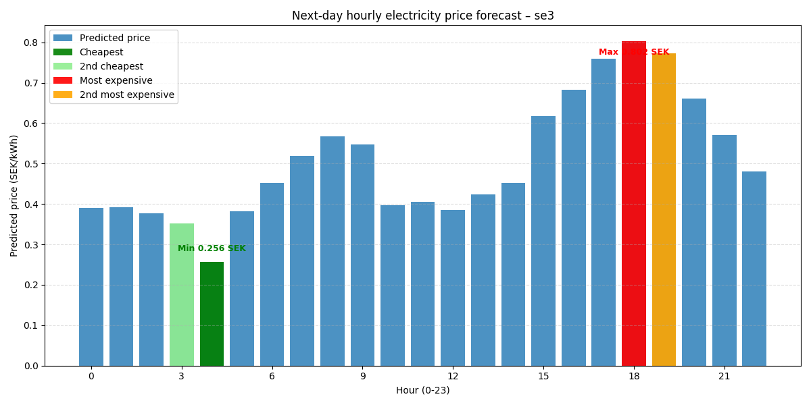

    <header class="bg-blue-600 py-8 mb-8 shadow-lg">
        

            <h1 class="text-3xl font-bold text-white">Electricity Price Dashboard</h1>
            
Prediktioner för Stockholm (SE3) baserat på väder och historik.

        

    </header>

    <main class="max-w-5xl mx-auto px-4 grid grid-cols-1 md:grid-cols-2 gap-8">
        
        

            <h2 class="text-2xl font-bold mb-4 text-gray-800">Morgondagens priser (Prediktion)</h2>
            
            
Grafen uppdateras dagligen kl 08:00 via GitHub Actions.

        

        

            <h2 class="text-2xl font-bold mb-4 text-gray-800 uppercase tracking-wider">Modellens Träffsäkerhet</h2>
            
        

        

            <h2 class="text-2xl font-bold mb-4 text-gray-800 uppercase tracking-wider">Systemstatus</h2>
            <ul class="space-y-3 mt-4">
                <li class="flex items-center text-sm text-gray-600">
                     Pipeline: GitHub Actions Aktiv
                </li>
                <li class="flex items-center text-sm text-gray-600">
                     Feature Store: Hopsworks
                </li>
            </ul>
        

    </main>

