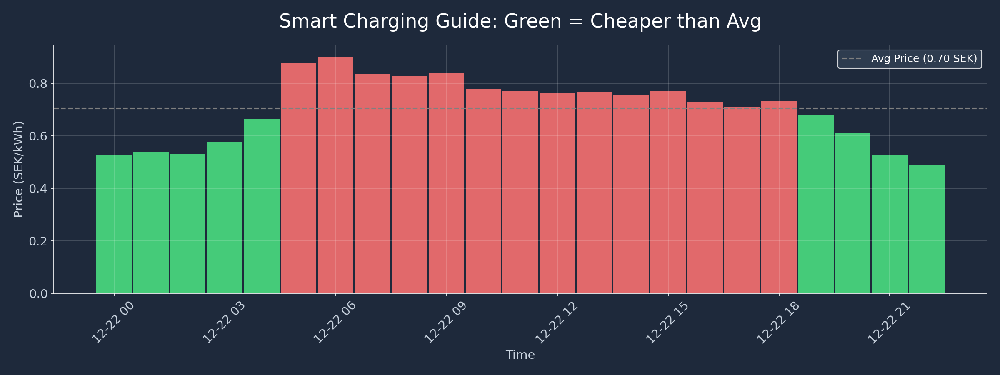
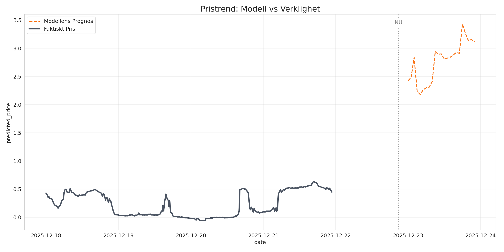
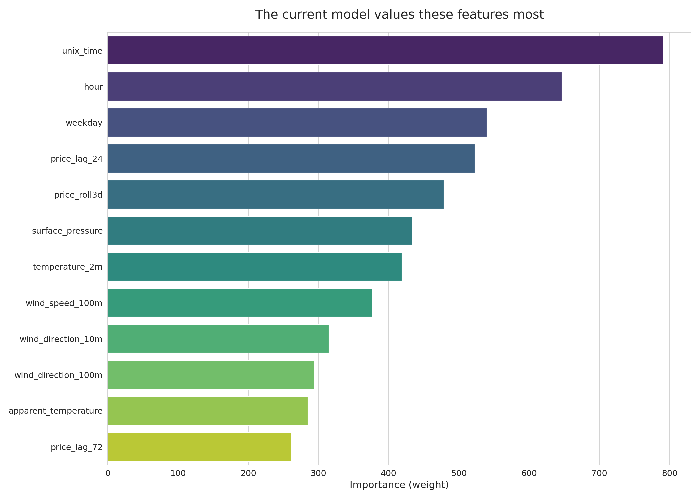

<link href="https://fonts.googleapis.com/css2?family=Inter:wght@300;400;600;800&display=swap" rel="stylesheet">

    <header class="border-b border-slate-800 bg-slate-950/50 py-12 mb-10 shadow-2xl">
        

            <h1 class="text-4xl md:text-6xl font-extrabold tracking-tight mb-4 text-white">
                 Electricity Price Forecast
            </h1>
            

                AI-powered predictions for the Stockholm Region (SE3).
                 Optimized for smart energy usage.
            

        

    </header>

    <main class="max-w-screen-2xl mx-auto px-4 sm:px-6 lg:px-8">

        <!--
          1) VALUE + CONTEXT
          2) DECISIONS (cheapest/expensive hours + best window + savings)
          3) TOMORROW HOURLY PREDICTIONS (main plot)
          4) RELIABILITY (predicted vs actual)
          5) EXPLANATION (feature importance)
          6) ABOUT (sources + pipelines + stack)
        -->

        

            

                

                    
Next-day forecast

                    <h2 class="text-2xl font-bold text-white mt-1">Tomorrow’s electricity price predictions (early access)</h2>
                    

                        Official day-ahead prices are typically published around <strong>13:00</strong>. This dashboard provides an earlier forecast so you can plan flexible consumption (EV charging, laundry, dishwasher) before the official release.
                        After 13:00, use official prices as the source of truth.
                    

                

                

                    
Forecast date: —

                    
Updated (UTC): —

                

            

            

                

                    
Cheapest hours

                    
—

                    
Good time for EV charging, laundry, dishwasher.

                

                

                    
Most expensive hours

                    
—

                    
Try to avoid flexible consumption in these windows.

                

                

                    
Cheapest 4-hour window (charging)

                    
—

                    

                        The lowest average price across <strong>4 consecutive hours</strong> tomorrow.
                    

                    

                        <label for="kwh" class="text-slate-400 text-sm whitespace-nowrap">Flexible load (kWh)</label>
                        <input id="kwh" type="range" min="2" max="40" value="10" class="w-full">
                        
10

                    

                    

                        Estimated savings: —
                    

                    

                        The slider only affects the savings estimate (it scales with how many kWh you can shift).
                    

                

            

        

        

                <!-- TOMORROW HOURLY PREDICTIONS -->
                

                    

                        <h2 class="text-xl font-bold text-white">Tomorrow: hourly predictions</h2>
                    

                    

                        

                            
                        

                        

                            

                                <strong>How to use:</strong> Use the green/amber/red bars as a quick guide for flexible consumption.
                                Combine this with the “Cheapest hours” and “Cheapest 4-hour window” cards above for an actionable plan.
                            

                        

                    

                

                <!-- RELIABILITY -->
                

                     

                        <h2 class="text-xl font-bold text-white">Model reliability (recent history)</h2>
                    

                    

                        

                            
                        

                        

                            

                                <strong>How to read:</strong> <strong>Black</strong> is the actual price, <strong>orange dashed</strong> is the model prediction over recent days.
                                This helps validate that the model tracks price dynamics before using it for planning.
                            

                        

                    

                

                <!-- EXPLANATION -->
                

                    

                        <h2 class="text-xl font-bold text-white">What drives the prediction?</h2>
                    

                    

                        

                            
                        

                        

                            

                                <strong>Understanding the graph:</strong> Higher bars mean the model relies more on that feature.
                                <em>Lag</em> features (e.g. <code class="text-slate-100">price_lag_24</code>) capture that prices often repeat daily patterns.
                            

                        

                    

                

                <!-- ABOUT -->
                

                    <h3 class="font-bold text-lg text-white mb-4">About the Project</h3>
                    

                        This project forecasts next-day hourly electricity prices for SE3 before the official day-ahead prices are published (~13:00).
                        The goal is to support morning planning for flexible consumption (EV charging, laundry, dishwasher).
                    

                    

                        
Data sources (APIs)

                        <ul class="space-y-2 text-sm text-slate-400">
                            <li>
                                <strong class="text-slate-200">Electricity prices</strong>:
                                day-ahead hourly prices for Sweden price areas (SE1–SE4) from
                                <a class="underline decoration-slate-600 hover:decoration-slate-300" href="https://www.elprisetjustnu.se/">elprisetjustnu.se</a>
                                (via the proxy API at
                                <a class="underline decoration-slate-600 hover:decoration-slate-300" href="https://api.elpris.eu/">api.elpris.eu</a>
                                when available).
                            </li>
                            <li>
                                <strong class="text-slate-200">Weather</strong>:
                                hourly forecast and historical weather from
                                <a class="underline decoration-slate-600 hover:decoration-slate-300" href="https://open-meteo.com/">Open‑Meteo</a>.
                            </li>
                        </ul>
                        

                            Note: after 13:00, official prices should be used as the source of truth.
                        

                    

                    

                        
Pipelines

                        

                            Daily ingestion updates the feature store, daily inference generates predictions and dashboard assets, and monthly training retrains the model.
                        

                        
Technology

                        

                            Python, XGBoost, Hopsworks Feature Store & Model Registry, GitHub Actions, GitHub Pages.
                        

                    

                    <a href="https://github.com/Jeppcode/Project" class="block w-full text-center bg-blue-600 hover:bg-blue-500 text-white font-semibold py-3 px-4 rounded-lg transition-all shadow-lg shadow-blue-500/20">
                        View Code on GitHub
                    </a>
                

        

        
        <footer class="mt-16 text-center text-slate-500 text-sm pb-8">
            &copy; 2025 Scalable Machine Learning Project.
        </footer>

    </main>

